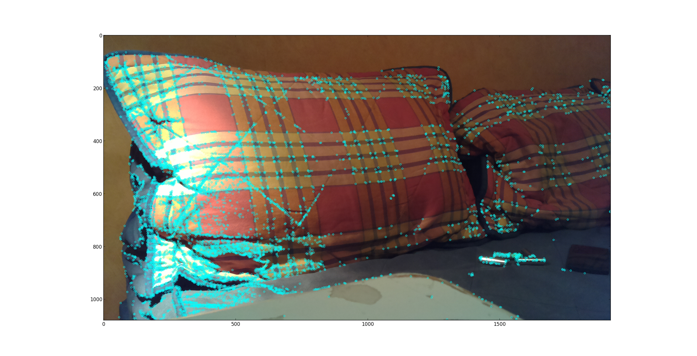

# Computer Vision MosaicPi
Code for a project in computer vision.

A very short project description: Stitch images for a mosaic panorama using servos and a raspberry pi.

### Progress

##### 2015-03-27
Physical model completed. The downside in using servos is that it's hard to control position.

##### 2015-04-04
Extracted keypoints using the 'FAST' algorithm, implemented in opencv

