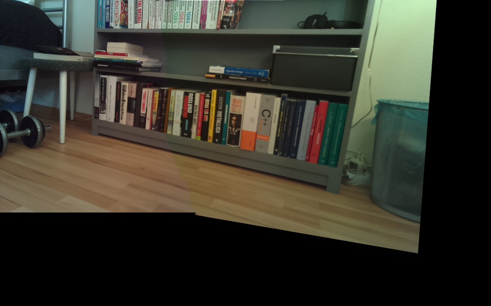

# Computer Vision MosaicPi
Code for a project in computer vision.

A very short project description: Stitch images for a mosaic panorama using servos and a raspberry pi.

### Progress

#### 2015-04-22
Nice results after only using translation fron the Ransac algorithm. 

"<a href="http://commons.wikimedia.org/wiki/File:NYC_Pan3.jpg#/media/File:NYC_Pan3.jpg">NYC Pan3</a>" by <a href="//commons.wikimedia.org/wiki/User:Jnn13" title="User:Jnn13">Jnn13</a> - Own work. Licensed under <a href="http://creativecommons.org/licenses/by-sa/3.0" title="Creative Commons Attribution-Share Alike 3.0">CC BY-SA 3.0</a> via <a href="//commons.wikimedia.org/wiki/">Wikimedia Commons</a>.
"<a href="http://commons.wikimedia.org/wiki/File:NYC_Pan4.jpg#/media/File:NYC_Pan4.jpg">NYC Pan4</a>" by <a href="//commons.wikimedia.org/wiki/User:Jnn13" title="User:Jnn13">Jnn13</a> - Own work. Licensed under <a href="http://creativecommons.org/licenses/by-sa/3.0" title="Creative Commons Attribution-Share Alike 3.0">CC BY-SA 3.0</a> via <a href="//commons.wikimedia.org/wiki/">Wikimedia Commons</a>.
"<a href="http://commons.wikimedia.org/wiki/File:NYC_Pan5.jpg#/media/File:NYC_Pan5.jpg">NYC Pan5</a>" by <a href="//commons.wikimedia.org/wiki/User:Jnn13" title="User:Jnn13">Jnn13</a> - Own work. Licensed under <a href="http://creativecommons.org/licenses/by-sa/3.0" title="Creative Commons Attribution-Share Alike 3.0">CC BY-SA 3.0</a> via <a href="//commons.wikimedia.org/wiki/">Wikimedia Commons</a>.

#### 2015-04-19
Test stitching after seam was found.

First successful seam found. Key idea is to remove certain areas that cross the seam.

#### 2015-04-13
Better stitching.

#### 2015-04-11
Managed to stitch two images. Aligns good, but blending is not ok.

#### 2015-04-09
Now inliers and corresponding points are included in the plots. 

#### 2015-04-08
First implementation of RANSAC. 

#### 2015-04-07
Got the SURF working. Rather good matching, some outliers.

Images used for matching are privately owned.

##### 2015-04-04
Extracted keypoints using the 'FAST' algorithm, implemented in opencv

##### 2015-03-27
Physical model completed. The downside in using servos is that it's hard to control position.

